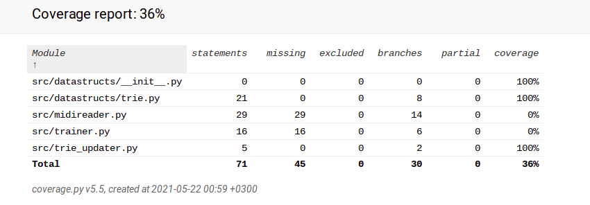

# Report week 2

Time used was approximately 10 hours

## What did I do?

 - set up the following things for the project (user manual has the command line commands)
    - poetry
    - lint
    - tests
 - created datastructure - Trie
 - created a simple midi-reader function for getting notes in order
 - created a training function for adding found notes into the Trie
 
## Unclear things

 - Nothing at the moment, help will be asked if something comes up
 
## Next week

 - Updating Trie for a specific need of this algorithm
 - implementing a functional version of the algorithnm
 - making a way to play the output
 - creating a simple UI (probably a command line operated)

 ## Test coverage

