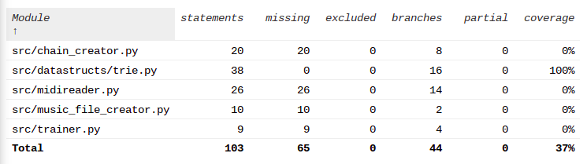

# Report week 3

Time used was approximately 11 hours

## What did I do?

 - Updated the trie class to better fits it purpose
 - updated the training function for more degrees of markov chain
 - created a simple ui (commands are in the user quide "Commands for program")
    - can be used to train and create/play music
 - created simple functional version of the algorithm
 
## Unclear things

 - Nothing at the moment, help will be asked if something comes up
 
## Next week

 - Implementing note length variation to the algorithm
    - maby also using it to play multiple notes at the same time (midi-file makes these thing connected)
 - creating linked tree/list to replace strings in the training algorithm/reading
 - Implementing testing for most things where it currenctly is missing
 - documentation for week 4

 ## Test coverage

