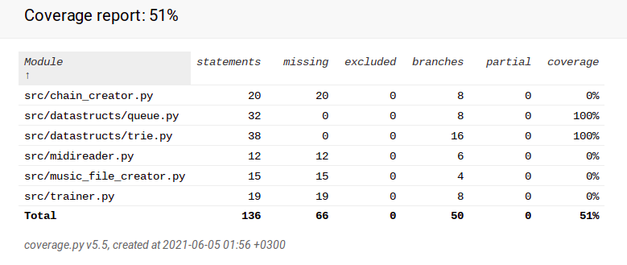

# Report week 4

Time used was approximately 7 hours

## What did I do?

 - Create a data structure Queue
 - Updated midi reading and creation functions to make it easier to implement note length and other note attributes in the future
 - Started testing file which currently is pretty empty
 - Started implementation document
 - added a note to user guide

## Unclear things

 - Is there an effective/reasonable way to implement "dict" in python
 
## Next week

 - Implementing note length variation to the algorithm (this won't be hard to implement for the improved reading and writing functions)
 - creating a linked list to replace strings
 - other required documentation/improving the exsistings ones
 - fix the poetry error
 
 ## Test coverage

