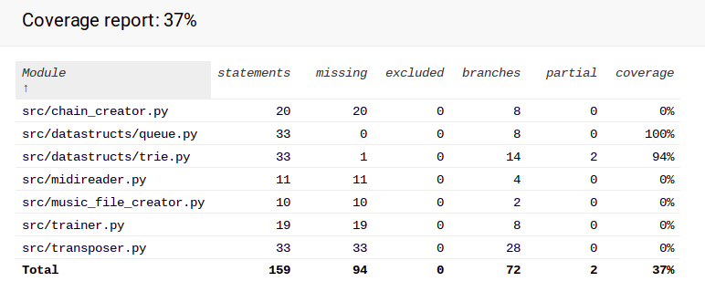

# Report week 3

Time used was approximately 7 hours

## What did I do?

 - created a transposing function to make converting and identifying Keys possible, it's in use but doesn't do anything at the moment
 - modified the ui to just take one input from the user (degree of the chain)
 - fixed the poetry error by removing the playing aspect (pygame mixer won't work with poetry if a file is created during the task apparently)
 - replaced lists with linkedlists (queues) where possible
 - updated the user manual
 - updated trie to work without the dict object

## Unclear things

 - None
 
## Next week

 - Finally implementing the long proposed note lenght variation
 - adding simple harmony
 - creating/updating documentation
 
 ## Test coverage

