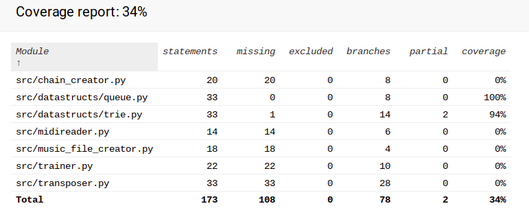

# Report week 6

Due to extreme lack of it, time used was approximately 2 hours
Most things planned for this week will be implemented late over the weekend (time variation + documentation + rightness of output testing)

## What did I do?

 - Updated UI to save created files (for testing purposes)
 - experimented (not implemneted yet) with time variation
 - Checked that all datastructures/algorithms were implemented from scratch (They should be)
 
## Unclear things

 - Nothing at the moment, help will be asked if something comes up
 
## Next week

 - In addition to weekend work, fine tuning and unit testing 

 ## Test coverage

